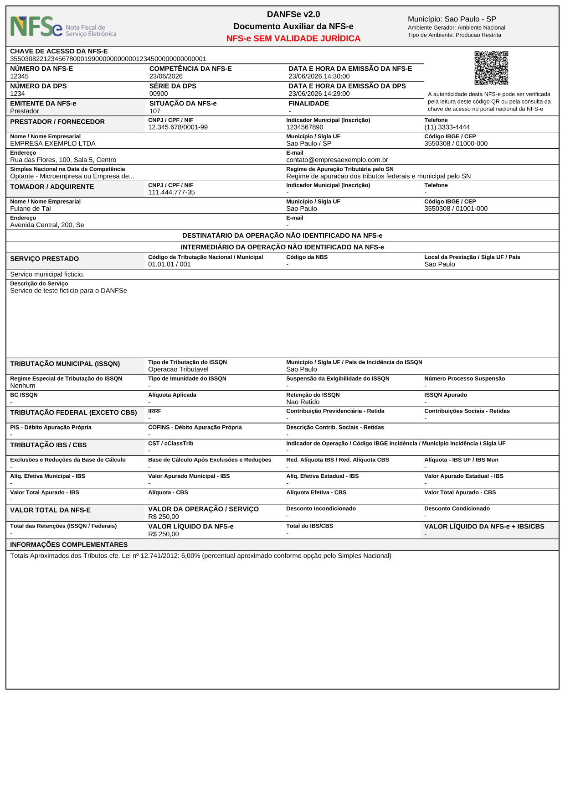
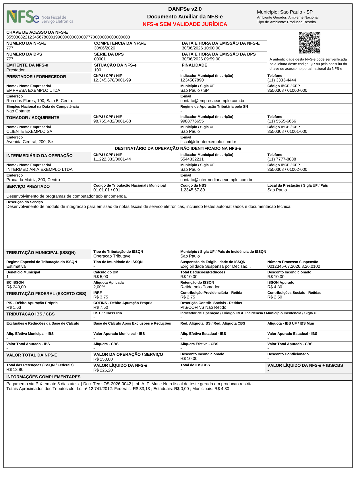

# xml-danfse-br

**Converte o XML autorizado da NFS-e Nacional no PDF do DANFSe — 100% local, seguindo o modelo oficial da NT 008/2026.**

[](https://central.sonatype.com/artifact/io.github.rzmt/xml-danfse-br)
[](https://github.com/rzmt/xml-danfse-br/actions/workflows/ci.yml)
[](LICENSE)


> ⚠️ **A API oficial de geração do DANFSe será desligada em 03/08/2026** (NT SE/CGNFS-e nº 008/2026,
> v1.02). A partir daí, **cada sistema emissor/ERP é responsável por gerar o próprio PDF** a partir
> do XML da NFS-e. Esta biblioteca faz exatamente isso — é a única disponível no Maven Central.

## Exemplo do PDF gerado

| Nota simples (Simples Nacional) | Nota completa (retenções, intermediário) |
|---|---|
|  |  |

Todos os exemplos usam XMLs **fictícios** (em [`src/test/resources`](src/test/resources)); gere os
seus com a CLI abaixo.

## Instalação (biblioteca Java)

```xml
<dependency>
    <groupId>io.github.rzmt</groupId>
    <artifactId>xml-danfse-br</artifactId>
    <version>0.9.0</version>
</dependency>
```

```kotlin
// Gradle
implementation("io.github.rzmt:xml-danfse-br:0.9.0")
```

## Uso

```java
import br.com.xmldanfse.DanfseGenerator;

String xml = Files.readString(Path.of("nfse.xml"));   // XML autorizado (<NFSe><infNFSe>...)
byte[] pdf = DanfseGenerator.gerarPdf(xml);           // ambiente inferido do tpAmb do XML
Files.write(Path.of("danfse.pdf"), pdf);
```

Com logo do prestador no cabeçalho:

```java
String logo = DanfseGenerator.dataUriImagem(Path.of("logo.png")); // PNG/JPG/SVG, redimensionado
byte[] pdf = DanfseGenerator.gerarPdf(xml, DanfseConfig.comLogoEmitente(logo));
```

## CLI (qualquer linguagem/sistema)

Baixe o `xml-danfse-br-cli-<versão>.jar` em [Releases](https://github.com/rzmt/xml-danfse-br/releases)
— não precisa de Maven, só Java 17+:

```bash
java -jar xml-danfse-br-cli.jar nota.xml                      # gera nota.pdf ao lado
java -jar xml-danfse-br-cli.jar nota.xml -o /tmp/danfse.pdf --logo-emitente logo.png
```

Útil para acoplar a sistemas PHP/Python/Node/legados via linha de comando enquanto o
port nativo não chega. Códigos de saída: `0` ok, `1` erro de uso, `2` erro de geração.

## Conformidade com a NT 008/2026 (v1.02)

O PDF segue o **modelo obrigatório do Anexo I**: disposição de blocos, margens (0,2 cm), borda de
1pt, divisórias de 0,5pt, sombreamento cinza 5%, fontes mínimas de 6/7pt, QR Code de **1,52 × 1,52 cm**
com a URL oficial de consulta pública, texto de autenticidade, bandas "NÃO IDENTIFICADO NA NFS-e",
tratamento v1.02 de PIS/COFINS retidos, linha obrigatória dos **Totais Aproximados dos Tributos**
(Lei 12.741/2012) e página única. Fonte **Liberation Sans embutida** (métrica compatível com a
Arial exigida; OFL 1.1) — renderização idêntica em qualquer visualizador.

Status detalhado item a item: [`docs/nt008-checklist.md`](docs/nt008-checklist.md).

- ✅ Leiaute NFS-e Nacional **1.01** (`http://www.sped.fazenda.gov.br/nfse`)
- ✅ Notas de produção restrita estampam **"NFS-e SEM VALIDADE JURÍDICA"** (via `tpAmb` — não
  confunde com `ambGer`, um erro comum que marca nota válida como homologação)
- ✅ Seção IBS/CBS estruturada (NT 009 — melhor esforço até o novo cronograma oficial)
- ✅ 100% offline por padrão nos testes; em runtime, nomes de municípios podem ser resolvidos na
  API pública do IBGE (desative com `-Dxmldanfse.ibge=false`)
- ✅ Parser XML com proteção XXE; nenhum dado sai da sua máquina

## Alternativas em outras linguagens

| Projeto | Linguagem | Observações |
|---|---|---|
| **xml-danfse-br** (este) | **Java** | única lib DANFSe no Maven Central; CLI standalone |
| [BrazilFiscalReport](https://github.com/Engenere/BrazilFiscalReport) | Python | DANFE/DACTE/DANFSE |
| [danfse-nacional](https://github.com/CristianoMZN/danfse-nacional) | PHP | sem dependências de framework |
| [danfse-pdf-generator](https://www.npmjs.com/package/danfse-pdf-generator) | Node.js | via pdfmake |

## Limitações e roadmap

- **Página única** (exigência da NT): descrições muito longas são truncadas com reticências, como
  prevê a própria NT. Suporte a anexo de continuação está no roadmap.
- Campos `cStat`/`finNFSe`/`tpBM` exibem o código quando a tabela oficial de descrições não se
  aplica (detalhes no checklist).
- Marca d'água "CANCELADA"/"SUBSTITUÍDA" (o XML autorizado sozinho não carrega essa informação):
  roadmap.
- NT 009 (IBS/CBS) completa quando o novo cronograma for publicado; port npm/TypeScript planejado.

## Desenvolvimento

```bash
mvn clean verify                      # build + 31 testes (offline)
mvn test -Dgolden.update=true         # regenera as referências dos testes visuais
mvn -Pcli package                     # fat-jar da CLI em target/
```

Testes golden-file comparam o PDF rasterizado pixel a pixel com tolerância — mudanças de layout
quebram o build e ficam visíveis em `target/golden-diff/`.

## Licenças

Código **MIT**. Componentes de terceiros: OpenHTMLtoPDF (LGPL-2.1, dependência de runtime),
PDFBox/ZXing (Apache-2.0), Liberation Sans (OFL-1.1, embutida nos PDFs), logomarca oficial da
NFS-e (CC BY-ND 3.0, redistribuída sem modificações). Detalhes em [`NOTICE.md`](NOTICE.md) e
[`THIRD-PARTY.md`](THIRD-PARTY.md).

---

Extraído do [nfse-java-mcp](https://github.com/rafael-matos-dev/nfse-java-mcp) (SDK + servidor MCP
para emissão de NFS-e Nacional), onde a geração local do DANFSe nasceu e foi refinada.
